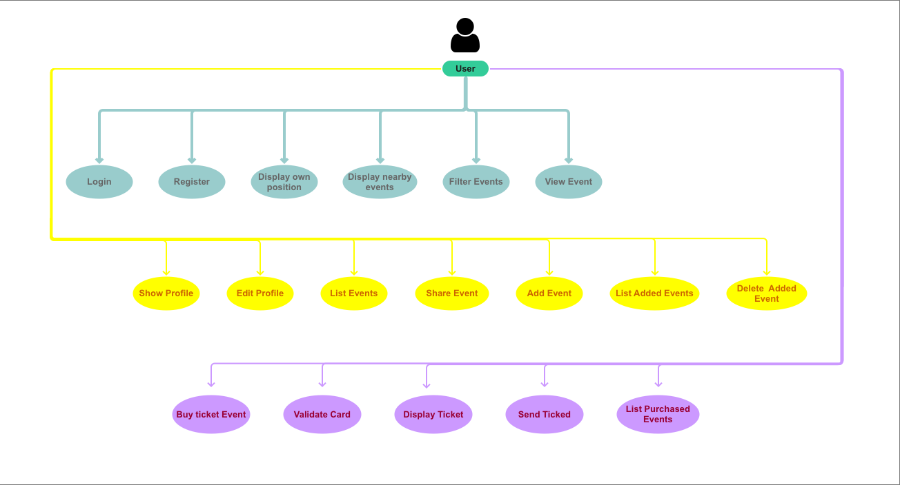
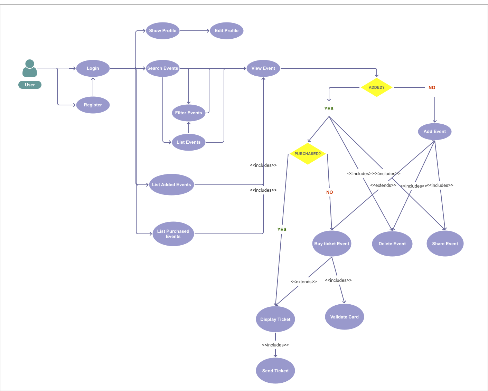
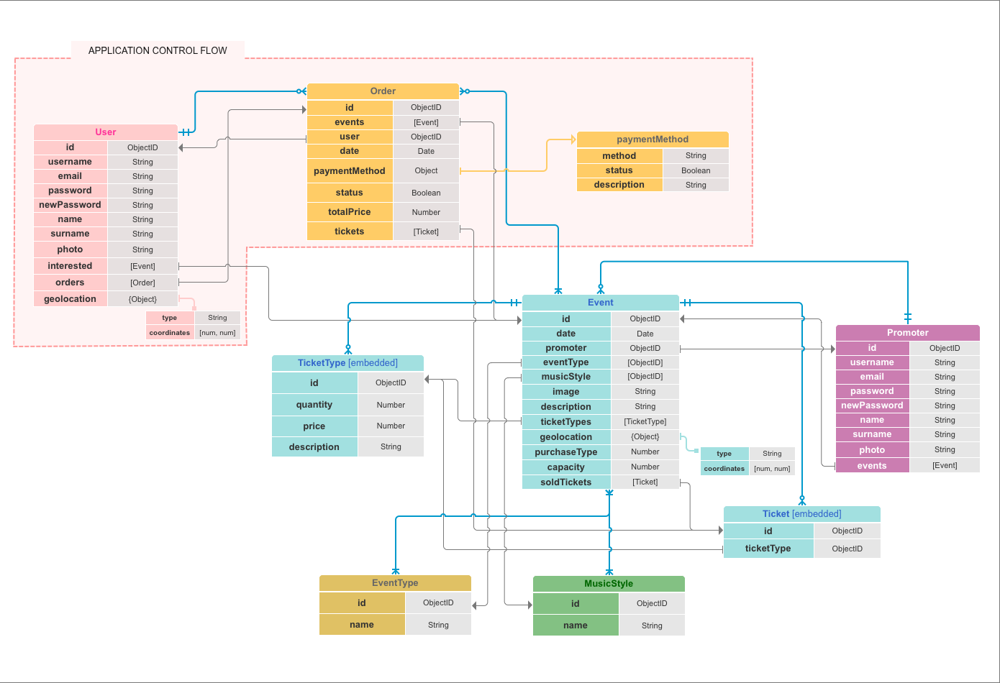
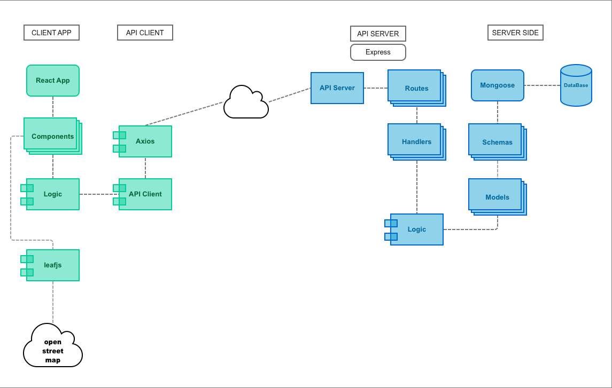
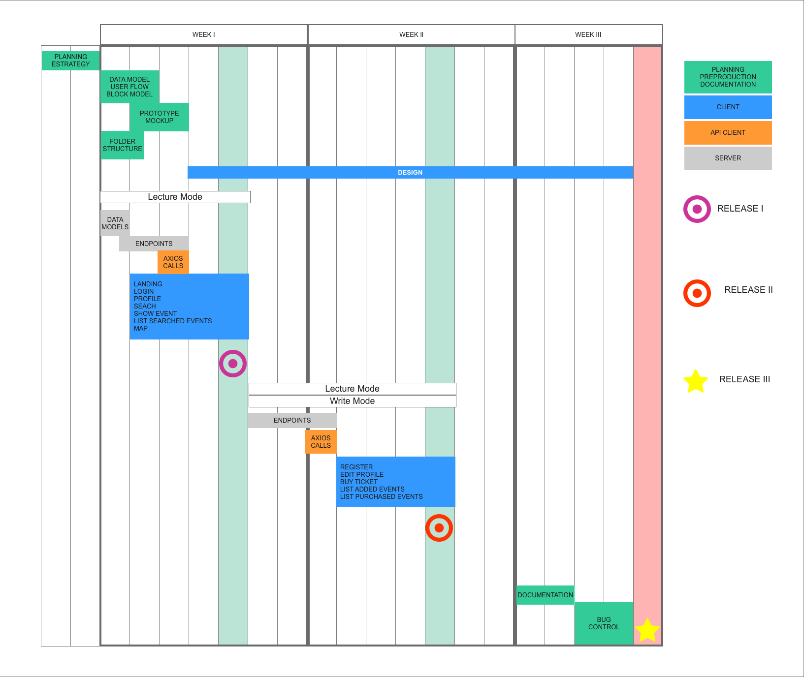
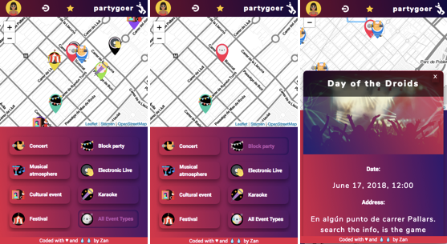

# partygoer app 

> ### **partygoer** searches nearby events for you.
------

### Target:
----

This project is a mobile first design (app thinking) that allows users to geolocate their position and easily find events located within a radius of 1000 meters, answering the classic and drunk question *"where is a party?"*

### Functional description:
----

In this application the user must register, login and allow the activation of the geolocation api browser in his terminal before being able to access a map that shows his position and all those events and nearby parties.       

After that, the user can filter the parties for a type of event type.

In a future iteration, the user will be able to save events and buy tickets to them.   
   
The next phase will be to prepare the api so promoters can easily add their own parties to the **partygoer** database

### Project demo
----
> https://partygoer.surge.sh

`IMPORTANT HTTPS! Secure context needed`

#  User cases (UML Diagram)
------

The following picture describes the different actions that user can do.    
*[First release in blue]*

#  User work flow
------

# Technical description:
#   Data Model
------

The following diagram describes the data model of the application, built before the functional logic.
The part indicated as "application control flow" shows the data models to which api can currently access from the application side.

#  Block Model
------
The project was built following this layer separation architechture:

# Sprint Plan (Gantt Chart)
------

# Design (screenshots):

    

### Built with:
----

#### Transversal

Javascript (ES5, ES6), HTML5, CSS3, Git & Github, surge, heroku, Agile Methodology, Trello.
#### Front-end
- react: 16.4.0
- react-dom: 16.4.0
- react-leaflet: 1.9.1
- react-router-dom: 4.2.2
- react-slick: 0.23.1
- react-toastify: 4.1.0
- slick-carousel: 1.8.1
- react-animated-css: 1.0.4
- animation.css: 0.1.0
- leaflet: 1.3.1
- prop-types: 15.6.1
- babel-cli: 6.26.0
- babel-preset-es2015
- axios: 0.18.0
- chai: 4.1.12
- dotenv: 6.0.0
- jsonwebtoken: 8.2.2
- lodash: 4.17.10
- sinon: 5.0.10

#### Back-end
- mongoose: 5.1.3
- express: 4.16.3
- routes: 2.1.0
- chai: 4.1.2
- dotenv: 6.0.0
- lodash: 4.17.10
- moment: 2.22.2
- body-parser: 1.18.3
- cors: 2.8.4
- jsonwebtoken: 8.2.2

## Authors
---

> Zan

### Acknowledgment
---

>to all my Skylab mates

> [Manu](https://github.com/manuelbarzi) 

> [Carlos](https://github.com/Asix94) 

> [Alejandro](https://github.com/agandia9)

> [Alan](https://github.com/alanbover)

> [David](http://www.skylabcoders.com/es)

Licenses:
> Flaticon icons